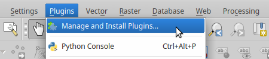

User Manual
***********

Installation
############

NOFAInsert plugin is not a part of the
`official QGIS repository <https://plugins.qgis.org/>`__.
However, it still can be installed the same way as other plugins.
All you need to do is to add a NINA repository.

First open :guilabel:`Plugins` :menuselection:`-->`
:guilabel:`Manage and Install Plugins...`.

   Open plugin manager.

In :guilabel:`Settings` tab activate option
:guilabel:`Show also experimental plugins`.

By clicking on :guilabel:`Add...` button add a
`NINA <http://www.nina.no/english/Home>`__ repository:

::

   Name:	NINA
   URL:		http://vm-srv-finstad.vm.ntnu.no/NOFA_plugins/plugins.xml

.. figure:: images/installation-add_repository.png

   Add repository.

.. figure:: images/installation-add_nina_repository.png
   :width: 60%

   Add NINA repository.

In :guilabel:`All` or :guilabel:`Not installed` tab search for ``NOFAInsert``.
Select NOFAInsert plugin and click on :guilabel:`Install plugin`.

.. figure:: images/installation-plugin_installation.png

   Plugin installation.

After a successful installation plugin's icon will appear in
:guilabel:`Plugins Toolbar`.
You can start NOFAInsert plugin by clicking on its icon or by selecting
:guilabel:`Plugins` :menuselection:`-->` :guilabel:`NOFAInsert`
:menuselection:`-->` :guilabel:`NOFAInsert`.

.. figure:: images/installation-plugins_toolbar_icon.png

   Plugin icon in Plugins Toolbar.

Setting Up Connection
#####################

Before inserting data into `NOFA <https://github.com/NINAnor/NOFA/wiki>`__
database you need to set up database connection
paramaters.

.. todo::
   Add screenshot.

Graphical User Interface
########################

Graphical user interface of the main window contains two tabs - :guilabel:`Main`
and :guilabel:`History`.

.. figure:: images/gui-main_gui.png

   Graphical User Interface.

Element 1:
   Tabs switcher.

Element 2:
   Name of a database the plugin is connected to.
